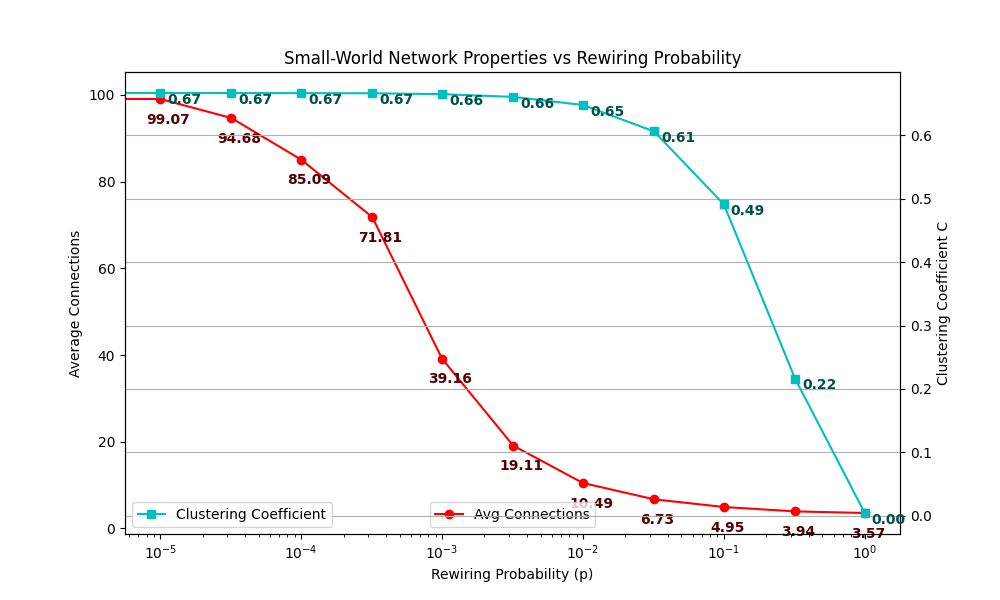

# smallWorld.py — Watts–Strogatz Small‑World Model

This project implements a **Watts–Strogatz small‑world network** from scratch using pure Python and basic data structures. It recreates the model using a custom version of `Graph`, `Vertex`, and `Queue` classes based on ```https://runestone.academy/ns/books/published/pythonds/BasicDS/ImplementingaQueueinPython.html```, and ```https://runestone.academy/ns/books/published/pythonds/Graphs/Implementation.html``` (in the style of *Problem Solving with Algorithms and Data Structures*).

The script allows you to:

* Construct Watts–Strogatz graphs for any rewiring probability (p)
* Compute **average shortest path length** using BFS
* Compute **clustering coefficient**
* Plot how path length and clustering change as (p) varies

---
## Background

The Watts–Strogatz model, introduced in 1998 by Duncan Watts and Steven Strogatz, explains how many real-world networks combine two seemingly opposite properties:

1. High Clustering
Nodes tend to form tightly knit groups where neighbors are also connected to each other. Social networks are a classic example—your friends are often friends with one another.

2. Short Average Path Length
Despite local clustering, any node can typically reach any other node through only a few steps (the famous "six degrees of separation"). This creates a small-world effect.

The model starts with a perfectly regular ring lattice where each node is connected to its k nearest neighbors. Then, with probability p, edges are rewired to random nodes. As p increases:

At p = 0, the graph is fully regular: high clustering, long path lengths.

At tiny p, a few random shortcuts appear. Path length collapses, but clustering remains high. This is the small-world region.

At p = 1, the graph becomes random: low clustering, very short path lengths.

The small-world phenomenon is observed in social networks, brain networks, power grids, transportation systems, and many biological systems. It demonstrates how a small amount of randomness can drastically improve connectivity without destroying local structure.


## Output



---

## Project Contents

### `Graph` and `Vertex`

From https://runestone.academy/ns/books/published/pythonds/Graphs/Implementation.html

Custom implementations that store nodes, neighbors, and undirected edges. They support adding/removing edges and iterating through vertices.

### `Queue`

From https://runestone.academy/ns/books/published/pythonds/BasicDS/ImplementingaQueueinPython.html

A simple FIFO queue used in BFS when measuring shortest paths.

### `wattsStrogatzGraph(n, k, p)`

Builds a Watts–Strogatz graph with:

* `n` nodes labeled `0 .. n-1`
* each node initially connected to `k` nearest neighbors on a ring
* edges rewired with probability `p`

This reproduces the classic transition from regular → small‑world → random networks as `p` increases.

### `avgShortestPathLength(g)`

Uses BFS from every node to compute the mean shortest path length of the graph.

### `clusteringCoefficient(g)`

Calculates the average clustering coefficient based on how interconnected each node’s neighbors are.

### `plotSmallWorld(...)`

Runs multiple trials for a set of `p` values and plots:

* Average shortest path length (L)
* Clustering coefficient (C)

Both are plotted on a shared logarithmic x‑axis to illustrate the small‑world effect.

### `__main__`

When run directly, the script generates plots for:

```
n = 2000
k = 10
trials = 16
```

---

## What the Script Demonstrates

This implementation visualizes the behavior of small‑world networks:

* **High clustering** at low (p)
* **Low average path length** at moderate (p)
* Rapid transition even when only a tiny fraction of edges are rewired

This mirrors real social networks, communication systems, and many biological networks where local structure coexists with short global distances.

---

## How to Run

1. Install Matplotlib:

   ```bash
   pip install matplotlib
   ```
2. Run the script:

   ```bash
   python smallWorld.py
   ```
3. Output plots are saved in the `plots/` directory.

---

## Example Output

You will see two curves on the same figure:

* **L(p)** (average shortest path): drops sharply as rewiring begins.
* **C(p)** (clustering coefficient): stays high for small p, then gradually decreases.

This visualization reproduces the central result from the original Watts–Strogatz 1998 paper.

---

## Author

**Jesse Gerth**

Date: 07 December 2025
